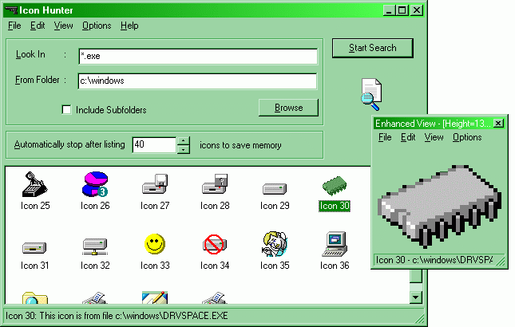



## Icon Hunter : Satisfy your thirst for icons

### Description

Hi Folks, If you are a Visual Basic programmer, I am almost sure that you are fond of icons. If you are tired of using those old icons, this application (with complete source code) is for you. It is a complete Icon Search application, which allows you to extract icons from executables and Icon libraries.

The story behind this application is interesting. One of the icon designers in my project team (I am presently working as the software manager of Time Technologies,Kerala,India) told me that it will be very helpfull if she can get an application for extracting already existing icons. She can then simply modify it or reuse it, instead of creating all icons from scratch. That is why I took few hours for writing this application.

Hey, one last thing to remember you. Kindly vote for me if this application can satisfy your ever increasing thirst for icons.

Also, I am looking for established US companies to invest in the technologies I developed, including the latest Streaming Audio Technology. If you are a US based developer, kindly visit http://www.geocities.com/streamingaudio if u have enough time, and let me know more about the investors and venture capitalists in US. Regards;

Anoop, anoopj12@angelfire.com, http://www.geocities.com/streamingaudio
 
### More Info
 
Importantly, the directory name to start the search for icon files, the maximum number of icons to list. Kindly see the application.

Icon Hunter :

----

Satisfy your ever increasing thirst for Icons

----

Version 1.0.0, May 2000 Release

By Anoop M, anoopj12@angelfire.com

----

Hey, one thing to remember you. Kindly vote for me if this application can satisfy your ever increasing thirst for icons. Kindly visit my website http://www.geocities.com/streamingaudio, for viewing the details of some technologies I developed (including my streaming audio technology)

Regards

Anoop, anoopj12@angelfire.com

A Lot Of Icons For You :)

Nothing in my notification

             |
---                |---
**Submitted On**   |2000-05-27 10:34:04
**By**             |[Anoop Madhusudanan](https://github.com/Planet-Source-Code/PSCIndex/blob/master/ByAuthor/anoop-madhusudanan.md)
**Level**          |Intermediate
**User Rating**    |4.7 (222 globes from 47 users)
**Compatibility**  |VB 5\.0, VB 6\.0
**Category**       |[Complete Applications](https://github.com/Planet-Source-Code/PSCIndex/blob/master/ByCategory/complete-applications__1-27.md)
**World**          |[Visual Basic](https://github.com/Planet-Source-Code/PSCIndex/blob/master/ByWorld/visual-basic.md)
**Archive File**   |[CODE\_UPLOAD61615272000\.zip](https://github.com/Planet-Source-Code/anoop-madhusudanan-icon-hunter-satisfy-your-thirst-for-icons__1-8406/archive/master.zip)

